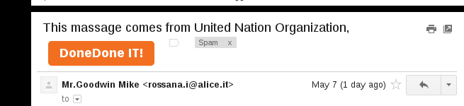

gmailToDoneDone
===============

This is a mix of Javascript and Python hacks to turn a Gmail Email into a [DoneDone](http://www.getdonedone.com) issue.

Why?
----

This project is here because I often copy-paste content of e-mails into DoneDone. I need to quickly create a ticket out of an email for one member of my team.

Tested with
----------

What follows has been tested exclusively with:

- my version of Google Chrome
- running in Debian Linux
- Python 2.7.3

Disclaimer
----------
This software is provided by Savio Dimatteo "as is" and "with all faults." Savio Dimatteo makes no representations or warranties of any kind concerning the safety, suitability, lack of viruses, inaccuracies, typographical errors, or other harmful components of this software. There are inherent dangers in the use of any software, and you are solely responsible for determining whether this software is compatible with your equipment and other software installed on your equipment. You are also solely responsible for the protection of your equipment and backup of your data, and Savio Dimatteo will not be liable for any damages you may suffer in connection with using, modifying, or distributing this software.

How To
------

1. Install the Bookmarklet

    - drag this link &rarr; <a id="ddit" href="(javascript:(function(){addToDDFunc=function(){var%20getSelectedHtml=function(){var%20html=%22%22;if(typeof%20window.getSelection%20!=%22undefined%22){var%20sel=window.getSelection();if(sel.rangeCount){var%20container=document.createElement(%22div%22);for(var%20i=0,len=sel.rangeCount;i%20%3C%20len;++i){container.appendChild(sel.getRangeAt(i).cloneContents());}html=container.innerHTML;}}else%20if(typeof%20document.selection%20!=%22undefined%22){if(document.selection.type==%22Text%22){html=document.selection.createRange().htmlText;}}return%20html;};var%20issueBody=getSelectedHtml();if(issueBody===%22%22){issueBody=$(gmail.dom.email_contents()[0]).text();}$.ajax({type:%22POST%22,url:%22http://localhost:8011%22,dataType:'json',contentType:'application/json',data:JSON.stringify({%22title%22:gmail.get.email_subject().replace(/DoneDone%20IT!.*$/g,''),%22description%22:issueBody})}).done(function(data){if(typeof%20data==='object'%20%26%26%20data.hasOwnProperty('status')){if(data.status==='ok'){$('%23addToDDLink').css('background','%232B792B');}else{$('%23addToDDLink').css('background','red');alert(%22An%20Error%20occurred!%22);}}});};var%20v=%221.10.0%22;if(window.jQuery===undefined%20||%20window.jQuery.fn.jquery%20%3C%20v){var%20done=false;var%20script=document.createElement(%22script%22);script.src=%22//ajax.googleapis.com/ajax/libs/jquery/%22+v+%22/jquery.min.js%22;script.onload=script.onreadystatechange=function(){if(!done%20%26%26(!this.readyState%20||%20this.readyState==%22loaded%22%20||%20this.readyState==%22complete%22)){done=true;initMyBookmarklet();}};document.getElementsByTagName(%22head%22)[0].appendChild(script);}else{initMyBookmarklet();}function%20initMyBookmarklet(){(window.myBookmarklet=function(){$.getScript('https://raw.githubusercontent.com/KartikTalwar/gmail.js/master/gmail.min.js',function(){$('%23gbqfb').css('background','%23F26F21');window.gmail=Gmail();gmail.observe.on('open_email',function(){var%20added=0;var%20timer=setInterval(function(){if(added%20%3E%200){clearInterval(timer);}else{var%20domArray=gmail.dom.email_subject();if(domArray.length%20%3E%200){domArray[0].innerHTML+=['%3Ca%20id=%22addToDDLink%22%20href=%22%23%22%20onclick=%22addToDDFunc();return%20false%22%3EDoneDone%20IT!%3C/a%3E','%3Cstyle%3E%20%23addToDDLink%20{%20display:%20block;%20background:%20%23F26F21;%20width:%20136px;%20text-align:%20center;%20border-radius:%205px;%20color:%20white;%20text-decoration:%20none;%20cursor:%20pointer;%20cursor:%20hand;%20padding:%207px;%20font-weight:%20bold;%20float:%20left;%20margin:%208px;%20}%20%3C/style%3E'].join('');added=1;}}},1000);});});})();}})();)">Enable DoneDoneIT!</a> to your bookmarks bar.
    
    - TIP: you can generate the above link by copy pasting the content of bookmarklet.js into bookmarklet maker websites like [this one](http://chriszarate.github.io/bookmarkleter/).

2. Add your Done Done credentials

    - open doneDoneServer.py, scroll down and fill up the followings:
    
            domain = "<YOUR DONE DONE DOMAIN HERE>"
            token = "<YOUR API TOKEN GOES HERE>"
            username = "<YOUR DONEDONE USERNAME>"
            password = "<YOUR DONEDONE PASSWORD>"
            serverPort = 8011
            projectName = "<PROJECT NAME IN WHICH TO POST ISSUE>"
            fixerName = "<FIXER NAME>"
            testerName = "<TESTER NAME>"

    - pip install --user flask
    - pip install --user requests

3. Run the server

    - python ./doneDoneServer.py
    
4. Log into [GMail](http://www.gmail.com)

5. Click your bookmarklet to enable the DoneDone button

    - your gmail search icon should become orange, meaning the bookmarklet is enabled:
    
    

6. Now Open an email

    - an orange "DoneDone IT!" button should appear before the email subject

7. Click the DoneDone IT! button

    - **click it once!** &rarr; it should send the subject and the body to the listening python server.
    - the subject of the email will be the title of the issue
    - the body of the email will be the description of the issue
    - TIP: if you highlight a text before pressing that button, the selected text will be added into the DoneDone body instead!

